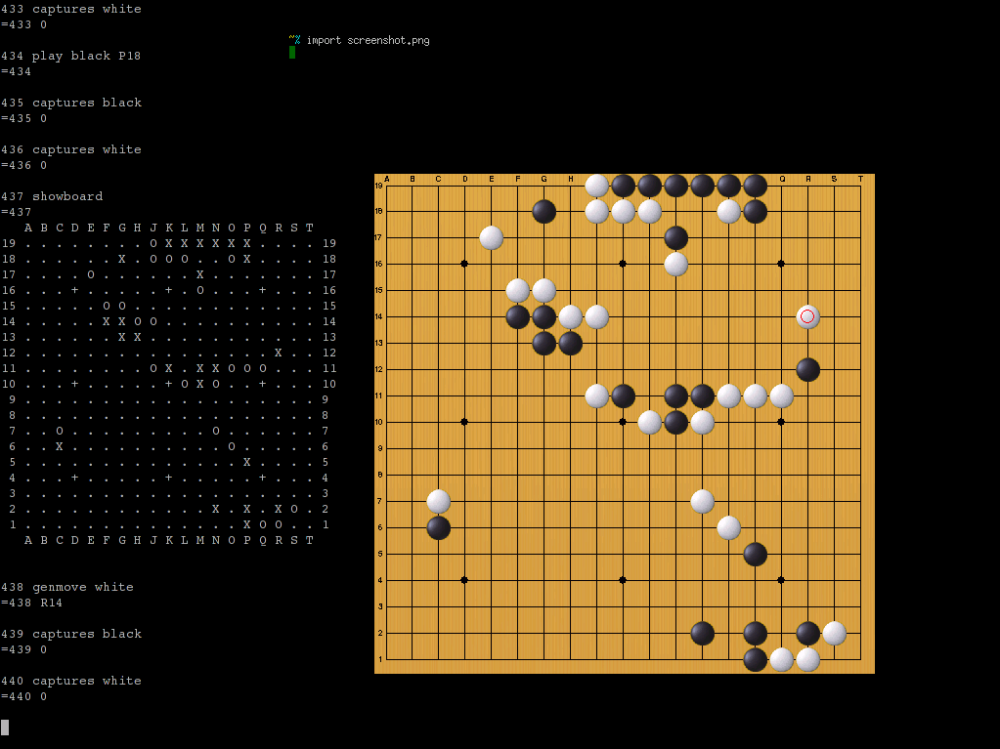

# Monkeyjump

## Overview

Monkeyjump is a program for messing around with GNU Go and SGF-files.

I wrote it back in 2005 but decided to release it in 2013, since it was somewhat fun.

Recently ported from Python 2 to Python 3.12.

## Screenshots




## Quickstart

Install Poetry, checkout the project and run:

```
poetry run ./monkeyjump
```

Default keybindings:

```
click to place a stone
g to view the last placed stone
z to pass (for white)
f to view the final score
backspace to clear the board and start a new game

q to quit
u to undo
e estimates the score
```

## General information

* GNU Go is a program that can play Go
* The term "monkeyjump" is used in Go
* Go is an approximately 4000 year old game
* Search the web for "igo", "baduk", "weichi" or "go" for more info about Go
  Here's the Wikipedia entry: http://en.wikipedia.org/wiki/Go_(board_game)


## What can I use it for?

* Interfacing GNU Go via GTP (the program speaks GTP for you)
* Guessing your way through professional games you might have stored as SGF
* Playing Go against GNU Go, while beeing able to edit the board at any time (this means you have to check for yourself if your move is valid)
* Avoiding Cgoban1 and/or the ascii-interface of GNU Go (Cgoban2 doesn't seem to support GNU Go directly)
* Stepping through an SGF-file
* Saving the pattern of the white stones as an image
* Saving basic SGF-files
* Playing with patterns of stones
* Checking what GNU Go would have played


## Requirements

* Python 3.12 and Pygame
* GnuGo or another GTP-speaking go-playing computer program (that speaks the same GTP dialect as gnugo, few do).


## Configuration

* Edit the file "gnugocmd.conf" in order to enable your favorite gtp-compatible program ("gnugo --mode gtp" should work).
* Edit the file "keybindings.conf", so that you know what all the keys does.
* Start the program. You can give a board size as the first argument (9, 13 and 19 are common)


## Known bugs

* Loading SGF-files doesn't always give the correct positions. Patches and pull requests are welcome.
* Does not work with Leela Zera or Katago yet.


## Thanks

Thanks to Ulrich Goertz (u@g0ertz.de) for the images of the board and the black and white stones,
which are included in his GPL-ed program [uliGo](http://www.u-go.net/uligo/).


## General info

* Author: Alexander F. Rødseth
* License: GPL2
* Version: 1.0.0
